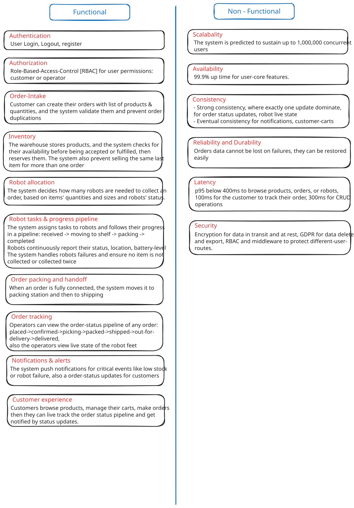
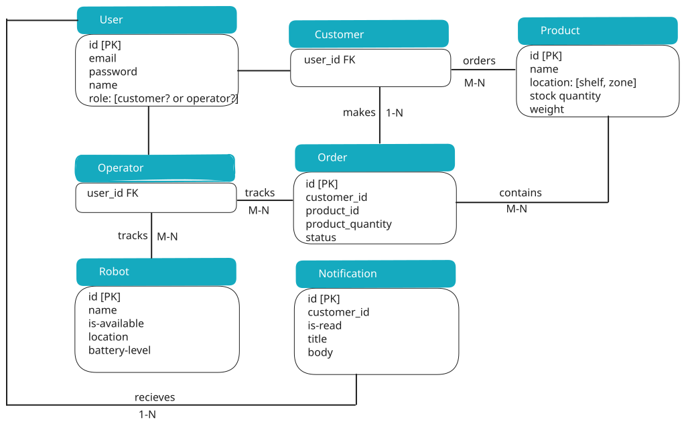
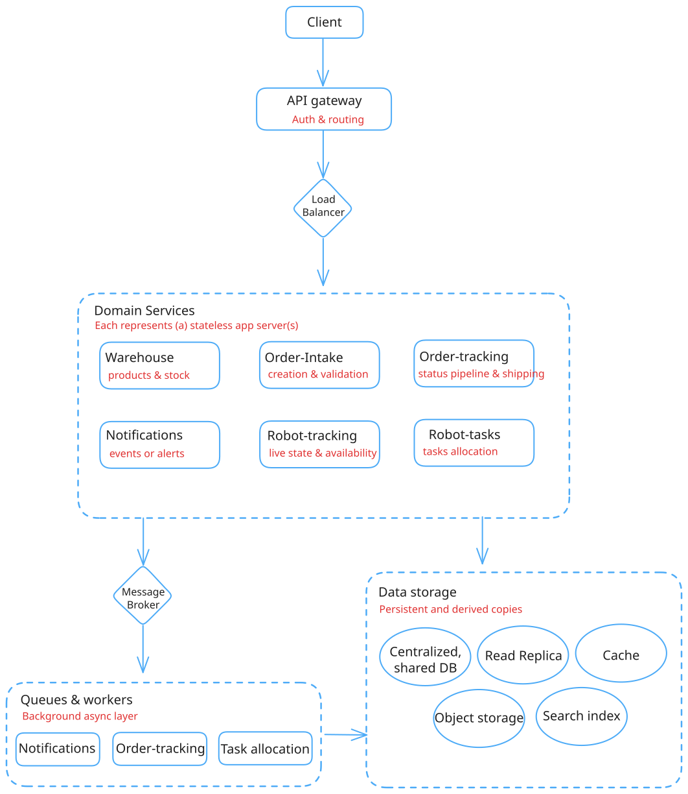

# AmazIEEE - System Design

Team: Victoris-Men8ir-Victories. Submission for CodeRefine Finals.

AmazIEEE is a a next-generation smart warehouse platform that doesn't just store products, but actively turns customer orders into picked and packed parcels using a fleet of autonomous robots.

This repo holds our design. Diagrams are in Excalidraw. Details for deep dives and estimates are in docs/.

## Contents

- Functional and non-functional requirements
- Data model
- API design
- High level architecture
- Deep dives: docs/deep-dives.md
- Estimates: docs/back-of-envelope.md

## 1. Functional requirements

What we built for:

- **Authentication:** login, register, user tokens
- **Authorization** and Role-Based-Access-Control [RBAC] for user permissions: customer or operator
- **Order Intake** : Customer can create their orders with list of products & quantities, and the system validate them and prevent order duplications
- **Inventory**: The warehouse stores products, and the system checks for their availability before being accepted or fulfilled, then reserves them. The system also prevent selling the same last item for more than one order
- **Robot allocation**: The system decides how many robots are needed to collect an order, based on items' quantities and sizes and robots' status.

- **Robot tasks & progress pipeline**: The system assigns tasks to robots and follows their progress
  in a pipeline: received -> moving to shelf -> packing ->
  completed
  Robots continuously report their status, location, battery-level
  The system handles robots failures and ensure no item is not
  collected or collected twice

- **Order packing and handoff**
- **Order tracking**
- **Notifications & alerts**
- **Customer experience**
- **Tasks**

We kept the list short on purpose. Each item maps to one API group below.

## 2. Non-functional requirements

- Scalability: site can handle up to 1,000,000 users at a time
- Latency: 400ms for browsing, 100ms for order tracking, 300ms for CRUD operations
- Reliability: the system keeps working correctly without failures or data loss
- Availability: the system stays up and reachable with 99.9% uptime
- Security: encryption, RBAC, rate-limiting, GDPR for export and deletion

Source: diagrams/00_functional-and-non-functional-requirements.svg

## 3. Data model

Source: diagrams/01-data-model.svg

Tables we use:

- User: id, email, password hash, role. One row per person. Role is operator or customer.
- Order: id, customer_id, product list, status
- Product: id, name, location in warehouse, stock quantity. Shared list so all users browse them.
- Robot: id, name, availability, battery-level, live-state
- Notifications: id, user_id, title, body, is_read. For events and alerts.

Relations:

| From     | To            | Type | Key                       |
| -------- | ------------- | ---- | ------------------------- |
| User     | Customer      | 1-1  | customer.user_id PK/FK    |
| User     | Operator      | 1-1  | operator.user_id PK/FK    |
| customer | orders        | M-N  | orders.customer_id FK     |
| product  | orders        | N-N  | order_porducts join table |
| User     | Notifications | 1-N  | Notifications.user_id FK  |

## 4. API design

Source: docs/api-design.md

We use token auth. User sends the token in the header.

| Endpoint                                 | Category      | Request-body                                    | Response            | status code    |
| ---------------------------------------- | ------------- | ----------------------------------------------- | ------------------- | -------------- |
| POST: /api/login                         | Auth          | email, password                                 | Token               | 200 OK         |
| POST: /api/register                      | Auth          | email, password, confirm-password, name         | Token               | 201 CREATED    |
| POST: /api/hire                          | Auth          | email, password, confirm-password, name         | Token               | 201 CREATED    |
| DELETE: /api/logout                      | Auth          | Token                                           | EMPTY               | 204 NO CONTENT |
| POST: /api/customer/orders               | Orders        | product-list, quantities, Token (Header)        | EMPTY               | 201 CREATED    |
| GET: /api/customer/orders                | Orders        | Token (Header)                                  | customer-order-list | 200 OK         |
| GET: /api/operator/orders                | Orders        | page, limit                                     | order-list          | 200 OK         |
| GET: /api/orders/{id}                    | Orders        | EMPTY                                           | order-details       | 200 OK         |
| GET: /api/orders/{id}/status             | Orders        | EMPTY                                           | robot-live-status   | 200 OK         |
| PATCH: /api/orders/{id}/status           | Orders        | status                                          | EMPTY               | 200 OK         |
| POST: /api/products                      | Products      | name, quantity, location: [shelf, zone], weight | EMPTY               | 201 CREATED    |
| GET: /api/products                       | Products      | page, limit                                     | product-list        | 200 OK         |
| GET: /api/products/{id}                  | Products      | EMPTY                                           | product-details     | 200 OK         |
| GET: /api/robots                         | Robots        | page, limit                                     | robot-list          | 200 OK         |
| POST: /api/robots                        | Robots        | name, battery-level                             | EMPTY               | 201 CREATED    |
| GET: /api/robots/{id}                    | Robots        | EMPTY                                           | robot-details       | 200 OK         |
| GET: /api/robots/{id}/state              | Robots        | EMPTY                                           | robot-live-state    | 200 OK         |
| PATCH: /api/robots/{id}/state            | Robots        | state of feet                                   | EMPTY               | 200 OK         |
| GET: /api/notifications                  | Notifications | page, limit                                     | notification-list   | 200 OK         |
| POST: /api/tasks                         | Tasks         | order-details                                   | Available-robot-id  | 201 CREATED    |
| POST: /api/tasks/assign                  | Tasks         | robot-id, order-id                              | EMPTY               | 200 OK         |
| POST: /api/notifications                 | Notifications | title, body, Token (Header)                     | EMPTY               | 201 CREATED    |
| PATCH: /api/notifications/{id}/mark-read | Notifications | EMPTY                                           | EMPTY               | 200 OK         |
| PATCH: /api/notifications/mark-all-read  | Notifications | EMPTY                                           | EMPTY               | 200 OK         |

Notes from building it:

- POST /customer/orders returns 409 if the same customer tries to make the same order twice. The DB unique key enforces this, not just app code.
- PATCH /orders/status only allows the next valid status. Bad jumps return an error.

## 5. High level architecture

Source: diagrams/02-architecture.svg

Parts:

- Client: web and mobile. Talks only to the API.
- API: entry point. Handles auth and routing to services
- Load-Balancer: spreads requests across the app servers.
- Stateless App-Servers: run the code. Any server can take any request. We add more in rush times, like black friday.
- Database: one shared central store. The servers are stateless so auth and all data live here.
- Object-storage: for large files such as images and videos.
- cache: heavy reads. product feeds, allocated tasks.
- Queues & workers: for background work.
- Tasks allocation algorithm: the allocation algorithm black box.

Flow:

1. Client -> API -> Load-Balancer -> any server -> Database or cache.
2. Writes go to the Database first, then the API pushes a queue job. The worker updates cache and sends notifications. This keeps writes safe and slow work out of the request.

We picked horizontal scaling because the user count grows and rush times spike. If search gets hot we split it out first. More in docs/deep-dives.md.

## 6. Deep dives

Full text: docs/deep-dives.md

Short version:

- Scaling: one server bottlenecks on CPU, memory, and concurrent requests. Load balancer over stateless servers. Trade-off is more infrastructure complexity.
- Database and object storage: one central DB first for consistency, read replicas later for read traffic. Replicas can lag. Large files go to object storage.
- Cache: popular feeds like products. Trade-off is some stale data. TTLs plus invalidation on change. Refresh popular entries early to avoid stampedes.
- Queues & workers: Tasks allocation runs in background so order creation returns fast. Scale workers by queue size. Trade-off is results are not immediate, plus retry handling.

## 7. Estimates

Full math: docs/back-of-the-envelope.md

We planned for 1,000,000 users, 400ms browsing, 100ms order tracking, 300ms CRUD, 99.9% uptime. Reads dominate, so cache and indexes matter more than adding app servers.
